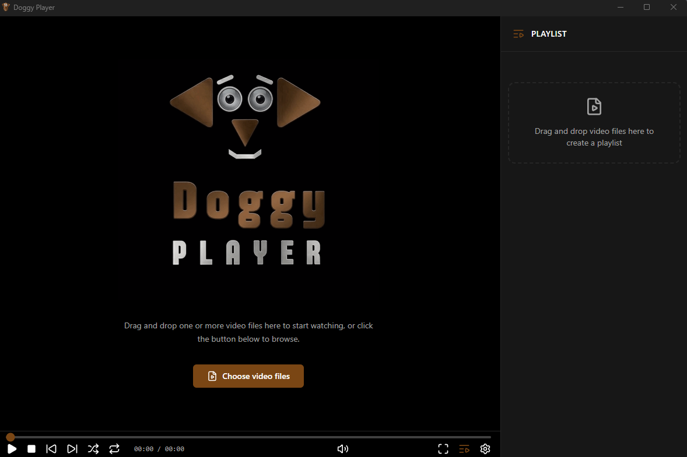
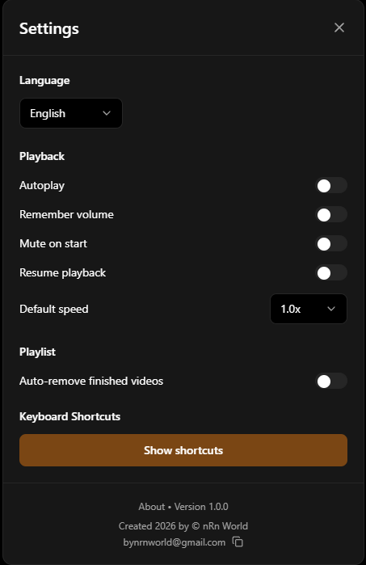
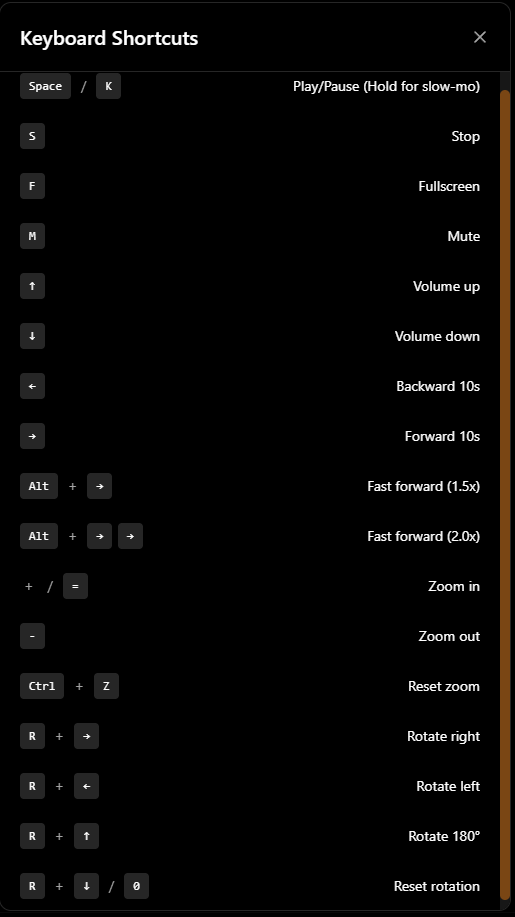
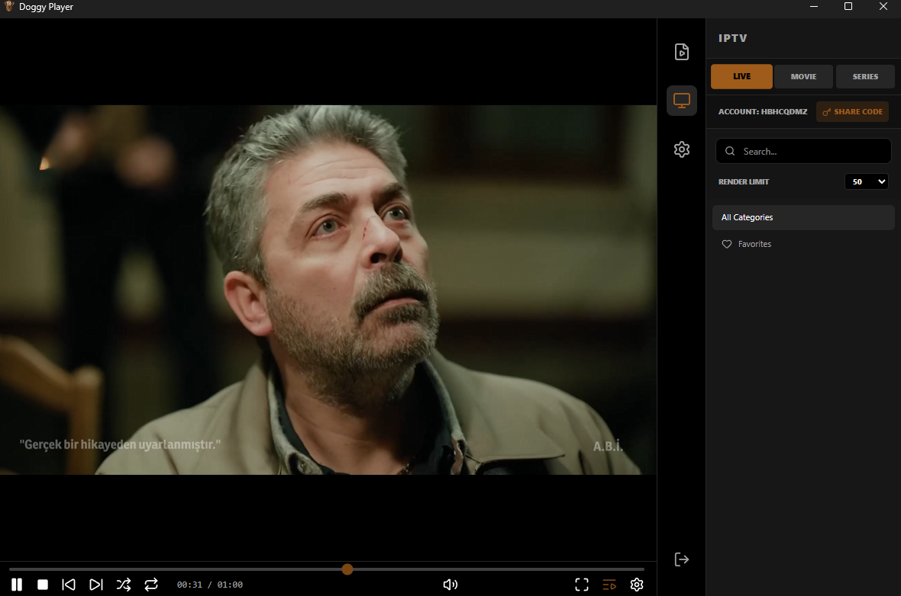
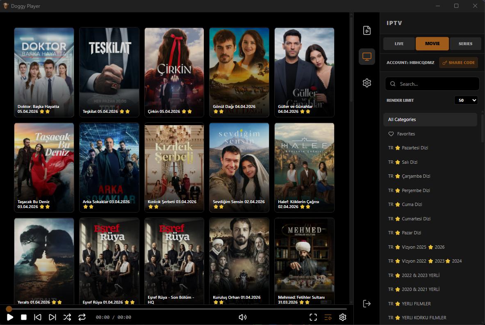

# Doggy Player 🐶


[](https://github.com/nRn-World/Doggy-Player)
[](https://www.typescriptlang.org/)
[](https://react.dev/)
[](https://github.com/nRn-World/Doggy-Player)

---

### ⚠️ COMMERCIAL USE & LICENSING NOTICE

This project is licensed under the **nRn World Non-Commercial License**.

*   **Individuals & Students:** Free to download, use, and modify for personal education and private use. You are **PROHIBITED** from generating any income or profit from this software or its code.
*   **Companies & Organizations:** Professional use requires prior written consent.
*   **Monetization:** Any commercial use, sale, or redistribution for profit requires a paid license.

**To purchase commercial rights, contact:** [bynrnworld@gmail.com](mailto:bynrnworld@gmail.com)

---

**Doggy Player** is a next-generation, high-performance video player built for modern users. Designed with a sleek, dark-themed interface, it offers unparalleled control over your viewing experience with unique features like intuitive mouse-wheel zooming, custom area selection, on-the-fly rotation, and seamless playlist management.

---

## Key Features

* **Advanced Zooming & Panning**: Smooth mouse-wheel zoom and click-to-pan.
* **Area Selection Zoom**: Hold `Shift` and draw a rectangle to zoom into details.
* **Video Rotation Controls**: Rotate with `Alt + Arrow keys` and reset to the original orientation at any time.
* **Per-Video Rotation Lock**: Save a manual rotation for a specific video and automatically restore it whenever that video is opened again.
* **Clean Rotation UI**: The rotation lock appears only after the user manually rotates the video in Doggy Player, not because of a video's built-in orientation metadata.
* **Video Brightness Control**: Adjust the active video from 50% to 150% brightness without modifying the original media file.
* **Per-Video Brightness Lock**: Lock a brightness level for a specific video and automatically restore it the next time that video is opened.
* **Brightness Shortcuts**: Press `Ctrl + Arrow Up` or `Ctrl + Arrow Down` to adjust brightness in 5% steps with an on-video percentage indicator.
* **Dynamic Playback Control**: Play, pause, seek, adjust volume, and use press-and-hold slow motion.
* **Smart Playlist**: Drag-and-drop support with optional automatic removal of finished videos.
* **IPTV Support**: Xtream Codes, M3U, and EPG support built in.
* **Subtitle Engine**: Support for `.srt`, `.vtt`, `.ass`, and additional subtitle formats with synchronization offset.
* **Screenshot Capture**: Capture frames instantly with `Alt + S`.
* **Equalizer**: Professional audio control with +/-12 dB adjustment.

---

## 📥 Getting Started

### For Users (Windows)
1.  Download the latest installer from the [**Releases**](https://github.com/nRn-World/Doggy-Player/releases) page.
2.  Run `Doggy-Player-Setup.exe`.
3.  Enjoy your media!

### For Developers (Setup)
We welcome community contributions! Please read our [**Contributing Guidelines**](CONTRIBUTING.md) before starting.

1.  **Clone the repo:**
    ```bash
    git clone https://github.com/nRn-World/Doggy-Player.git
    ```
2.  **Install dependencies:**
    ```bash
    npm install
    ```
3.  **Run in Development Mode:**
    ```bash
    npm run dev:electron
    ```
4.  **Build your own version:**
    ```bash
    npm run build:electron
    ```

---

## 🛡️ Security
We take security seriously. Please review our [**Security Policy**](SECURITY.md) to report any vulnerabilities.

---

## 📸 Screenshots

<p align="center">
  <a href="Screenshot/Sc1.png">
    
  </a>
  <a href="Screenshot/Sc2.png">
    
  </a>
  <a href="Screenshot/Sc3.png">
    
  </a>
</p>

<p align="center">
  <a href="Screenshot/IPTV.png">
    
  </a>
  <a href="Screenshot/Live.png">
    
  </a>
  <a href="Screenshot/Movie.png">
    
  </a>
</p>

---

## 🛠️ Tech Stack

*   **Core**: [Electron](https://www.electronjs.org/)
*   **Frontend**: [React 19](https://react.dev/), [Vite](https://vitejs.dev/)
*   **Styling**: [Tailwind CSS](https://tailwindcss.com/)
*   **Icons**: [Lucide React](https://lucide.dev/)

---

## 🤝 Community & Support
*   ⭐ **Star this project** if you find it useful!
*   🐛 **Report bugs** via [GitHub Issues](https://github.com/nRn-World/Doggy-Player/issues).
*   ☕ **Support development**: [Buy me a coffee](https://buymeacoffee.com/nrnworld)

---

---

## Release Notes v1.1.63

Doggy Player v1.1.63 adds flexible video brightness controls with per-video persistence:

* **Brightness adjustment:** Make the active video darker or brighter from 50% to 150%.
* **Visible percentage:** The current brightness percentage is displayed in the player controls and as an on-video indicator while adjusting.
* **Keyboard control:** Use `Ctrl + Arrow Up` and `Ctrl + Arrow Down` to change brightness in 5% steps.
* **Per-video lock:** Lock a brightness value for one video and automatically restore it whenever that video is opened again.
* **Non-destructive processing:** Brightness affects playback only and never modifies the original video file.
* **Automatic update:** Existing installations receive v1.1.63 through Doggy Player's built-in updater after the release assets are published.
