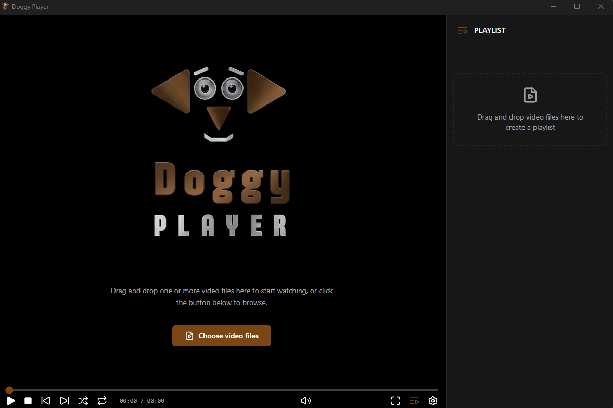
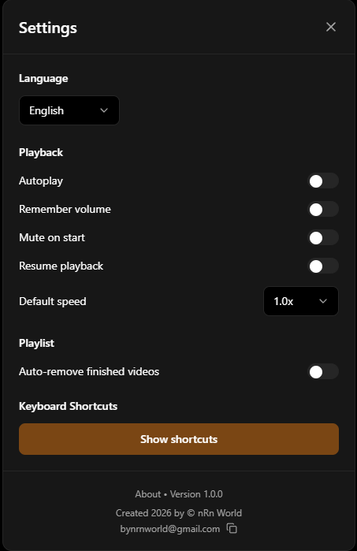
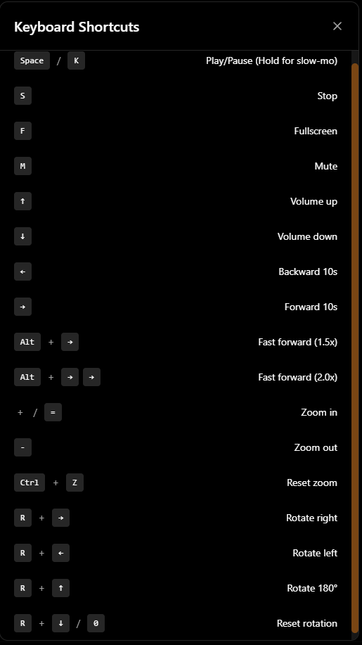
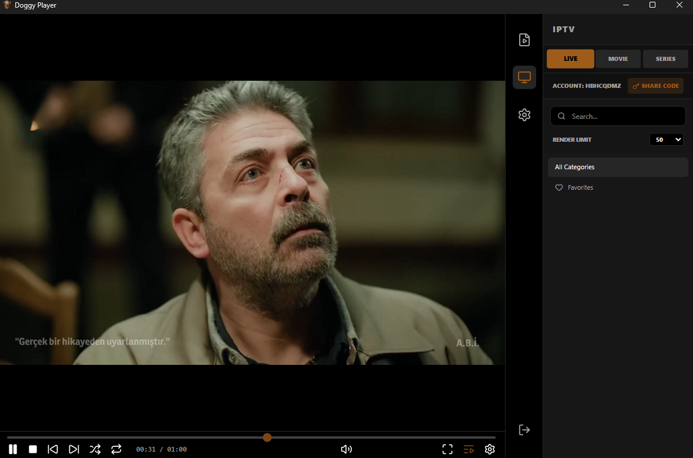
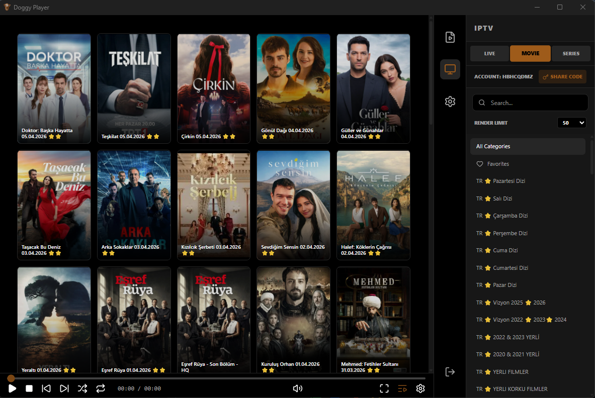

# Doggy Player 🐶


[](https://github.com/nRn-World/Doggy-Player/releases/latest)
[](https://github.com/nRn-World/Doggy-Player/releases)
[](https://github.com/nRn-World/Doggy-Player/stargazers)
[](https://github.com/nRn-World/Doggy-Player)
[](https://www.typescriptlang.org/)
[](https://react.dev/)
[](https://github.com/nRn-World/Doggy-Player)

---

### ⚠️ COMMERCIAL USE & LICENSING NOTICE

This project is licensed under the **nRn World Non-Commercial License**
([Creative Commons BY-NC 4.0](LICENSE.txt)).

*   **Individuals & Students:** Free to download, use, and modify for personal education and private use. You are **PROHIBITED** from generating any income or profit from this software or its code.
*   **Companies & Organizations:** Professional use requires prior written consent.
*   **Monetization:** Any commercial use, sale, or redistribution for profit requires a paid license.

**To purchase commercial rights, contact:** [bynrnworld@gmail.com](mailto:bynrnworld@gmail.com)

---

**Doggy Player** is a next-generation, high-performance video player built for modern users. Designed with a sleek, dark-themed interface, it offers unparalleled control over your viewing experience with unique features like intuitive mouse-wheel zooming, custom area selection, on-the-fly rotation, and seamless playlist management — all with VLC-style instant seeking.

---

## Key Features

* **VLC-Style Gapless Seeking (v1.1.75)**: Seeks land instantly with no audio/video "vibration" at the start of a jump — playback begins when real data exists, re-encoded streams interleave audio with the first picture, and pipe restarts use millisecond-exact offsets.
* **Native Seeking for Hard Files (v1.1.75)**: Files Chromium cannot decode (H.263, MPEG-4, MJPEG, WMV, ProRes, ...) are re-encoded once in the background to a dense-keyframe H.264/AAC MP4 and cached, so later seeks are as fast as a native file.
* **Smart Remux Seeking (v1.1.68)**: Detects MPEG-TS (and similar) files mislabeled as `.mp4` and remuxes them once to real seekable MP4 — fixes the ~1s freeze on certain large files.
* **Advanced Zooming & Panning**: Smooth mouse-wheel zoom and click-to-pan.
* **Area Selection Zoom**: Hold `Shift` and draw a rectangle to zoom into details.
* **Video Rotation Controls**: Rotate with `Alt + Arrow keys` and reset to the original orientation at any time.
* **Per-Video Rotation Lock**: Save a manual rotation for a specific video and automatically restore it whenever that video is opened again.
* **Clean Rotation UI**: The rotation lock appears only after the user manually rotates the video in Doggy Player, not because of a video's built-in orientation metadata.
* **Video Brightness Control**: Adjust the active video from 50% to 150% brightness without modifying the original media file.
* **Per-Video Brightness Lock**: Lock a brightness level for a specific video and automatically restore it the next time that video is opened.
* **Brightness Shortcuts**: Press `Ctrl + Arrow Up` or `Ctrl + Arrow Down` to adjust brightness in 5% steps with an on-video percentage indicator.
* **Precision Playback Control**: Play, pause, `5s` / `15s` (`Shift`) / `20s` (`Ctrl`) seek with hold-to-seek, adjustable volume and press-and-hold slow motion (0.25x).
* **Smart Playlist**: Drag-and-drop support with optional automatic removal of finished videos.
* **IPTV Support**: Xtream Codes, M3U, and EPG support built in.
* **Subtitle Engine**: Support for `.srt`, `.vtt`, `.ass`, and additional subtitle formats with synchronization offset.
* **Screenshot Capture**: Capture frames instantly with `Alt + S`.
* **Equalizer**: Professional audio control with +/-12 dB adjustment.

---

## 📥 Getting Started

### For Users

1.  Download the latest build from the [**Releases**](https://github.com/nRn-World/Doggy-Player/releases/latest) page.
    *   **Windows:** `Doggy-Player-Setup-<version>.exe` (recommended)
    *   **macOS:** `Doggy-Player-<version>.dmg`
    *   **Linux:** `Doggy-Player-<version>.AppImage`
2.  Run the installer and open Doggy Player.
3.  Already installed? Doggy Player keeps itself up to date automatically through its built-in updater — no manual downloading needed.
4.  Enjoy your media!

### For Developers (Setup)

We welcome community contributions! Please read our [**Contributing Guidelines**](CONTRIBUTING.md) and our [**Code of Conduct**](CODE_OF_CONDUCT.md) before starting.

1.  **Clone the repo:**
    ```bash
    git clone https://github.com/nRn-World/Doggy-Player.git
    ```
2.  **Install dependencies:**
    ```bash
    npm install
    ```
3.  **Run in Development Mode:**
    ```bash
    npm run dev:electron
    ```
4.  **Build your own version:**
    ```bash
    npm run build:electron
    ```

---

## 🛡️ Security
We take security seriously. Please review our [**Security Policy**](SECURITY.md) to report any vulnerabilities privately — never through a public issue.

---

## 📸 Screenshots

<p align="center">
  <a href="Screenshot/Sc1.png">
    
  </a>
  <a href="Screenshot/Sc2.png">
    
  </a>
  <a href="Screenshot/Sc3.png">
    
  </a>
</p>

<p align="center">
  <a href="Screenshot/IPTV.png">
    
  </a>
  <a href="Screenshot/Live.png">
    
  </a>
  <a href="Screenshot/Movie.png">
    
  </a>
</p>

---

## 🛠️ Tech Stack

*   **Core**: [Electron](https://www.electronjs.org/)
*   **Frontend**: [React 19](https://react.dev/), [Vite](https://vitejs.dev/)
*   **Styling**: [Tailwind CSS](https://tailwindcss.com/)
*   **Icons**: [Lucide React](https://lucide.dev/)
*   **Media**: [FFmpeg](https://ffmpeg.org/) (via `ffmpeg-static`), [hls.js](https://github.com/video-dev/hls.js/)

---

## 🤝 Community & Support

*   ⭐ **Star this project** if you find it useful — it really helps!
*   💬 **Ask questions and share ideas** in [GitHub Discussions](https://github.com/nRn-World/Doggy-Player/discussions).
*   🐛 **Report bugs** via [GitHub Issues](https://github.com/nRn-World/Doggy-Player/issues).
*   🤝 **Contribute code**: read [CONTRIBUTING.md](CONTRIBUTING.md) and follow our [Code of Conduct](CODE_OF_CONDUCT.md).
*   🛡️ **Report a security problem** privately through our [Security Policy](SECURITY.md).
*   ☕ **Support development**: [Buy me a coffee 💜](https://ko-fi.com/nrnworld)

---

## Release Notes v1.1.75

Seeking now behaves like VLC: the jump is instant, with no audio/video "vibration" at the start of a seek:

* **No more stutter at the start of a seek:** Playback now starts when real data exists instead of as soon as the track layout is known, so Chromium no longer fires `waiting` on every source swap.
* **Audio starts with the picture:** The re-encode pipe interleaves audio with the first picture instead of pushing the first audio packet ~0.4s further into the stream.
* **Seeking becomes native:** Files whose video codec Chromium cannot decode (H.263, MPEG-4, MJPEG, WMV, ProRes, ...) are re-encoded once in the background to a dense-keyframe H.264/AAC MP4 and cached; an already cached copy is adopted immediately on the next play.
* **Exact seek positions:** Pipe restarts are millisecond exact instead of rounded down to whole seconds.
* **Automatic update:** Installed apps receive v1.1.75 via the built-in updater.

## Release Notes v1.1.72

Smoother, quieter seeking:

* **Keyframe densification:** Files that seek poorly are re-encoded once to a dense-keyframe MP4 and cached, so subsequent jumps are fast.
* **Seek controller fixes:** Rapid scrubbing and hold-to-seek no longer stack requests; the playhead stays with the picture.
* **Vibration removal:** Reworked the seek path so jumps no longer produce the audio "vibration" heard before.
* **Automatic update:** Installed apps receive v1.1.72 via the built-in updater.

## Release Notes v1.1.71

Bug fixes.

## Release Notes v1.1.70

Bug fixes.

## Release Notes v1.1.69

Fixes settings dropdowns that closed immediately so you could not change default speed or IPTV default quality:

* **Settings menus stay open:** Replaced fragile native `<select>` controls with custom menus for language, default speed, and IPTV default quality.
* **Focus trap fixed:** The settings overlay no longer steals focus on every video time update (which closed open dropdowns instantly).
* **Auto-update for all platforms:** Windows (`latest.yml`), macOS (`latest-mac.yml`) and Linux (`latest-linux.yml`) are published to GitHub Releases.

## Release Notes v1.1.68

Fixes seek freezes on large files that are MPEG-TS (or similar) despite a `.mp4` extension:

* **Root cause:** Some “`.mp4`” files are actually MPEG-TS — Chromium freezes about 1 second on every seek.
* **Fix:** Detect real container, remux once with stream-copy to a real MP4 + faststart (quality preserved), then play that file.
* **Cached:** Next open of the same file skips remux and seeks immediately.
* **Automatic update:** Installed apps receive v1.1.68 via the built-in updater after release assets are published.

## Release Notes v1.1.67

Hotfix for a regression in v1.1.66:

* **Frozen picture / working audio:** Removed the FFmpeg scrub-preview overlay that could stay on top of the video after seeking.
* **Reliable resume:** Video playback is forced to continue after seek so picture and sound stay together.
* **Automatic update:** Installed apps receive v1.1.67 via the built-in updater after release assets are published.

## Release Notes v1.1.66

Doggy Player v1.1.66 fixes the remaining freeze when seeking large/HQ videos with arrow keys or the timeline:

* **Live scrub preview:** Holding ←/→ or dragging the timeline shows FFmpeg JPEG frames on top of the video so the picture keeps updating.
* **Seek once on release:** The real `<video>` seek runs only when you release keys/mouse — no stacked freezes on big files.
* **fastSeek, no pause-first:** Single seeks use keyframe seeking without pausing first (which made freezes worse in v1.1.65).
* **Automatic update:** Installed apps receive v1.1.66 via the built-in updater after release assets are published.

## Release Notes v1.1.65

Doggy Player v1.1.65 fixes freeze-on-seek for large and high-quality videos:

* **No more freeze when seeking:** Playback pauses briefly during seek, then resumes so the decoder is not overloaded on big/HQ files.
* **Direct disk playback:** Common local formats (mp4, mkv, mov, webm, …) use `file://` instead of HTTP Range for much faster seeks.
* **Smarter seek queue:** Rapid scrubbing and hold-to-seek coalesce into one in-flight seek (last-wins) instead of stacking decode jobs.
* **Smoother timeline & arrows:** UI time updates immediately; media seeks less often while you drag or hold ←/→.
* **Transcoded formats:** Debounced FFmpeg restarts for avi/ts and similar so seeks no longer pile up.
* **Automatic update:** Installed apps on **Windows, macOS and Linux** receive v1.1.65 automatically via the built-in updater (`latest.yml` / `latest-mac.yml` / `latest-linux.yml`).

## Release Notes v1.1.64

Doggy Player v1.1.64 delivers buttery-smooth seeking for large/long videos and pro-grade hold-to-seek controls:

* **Fixed lag on large files:** Timeline scrubbing is now debounced (`75ms`), uses `fastSeek` to the nearest keyframe and a subtle spinner instead of black flash — no more freeze on 4K/long `.mp4`/`.mkv`.
* **Faster local streaming:** Electron stream server now serves `32 MB` chunks with `512 KB` `highWaterMark`, proper `Content-Range` handling and MIME detection for instant seeks.
* **New seek steps:** Single tap `Arrow Left/Right` is now `5s` (was `10s`), `Shift` + arrow = `15s`, `Ctrl` + arrow = `20s`.
* **Hold to seek:** Hold `Arrow Left/Right` (or `Ctrl`/`Shift` + arrow) to continuously seek until you release — perfect for long videos.
* **Smarter UI:** Seeking state is tracked separately from buffering, so `onTimeUpdate` stays smooth and the timeline stays responsive while the video decodes.
* **Automatic update:** Installed apps on **Windows, macOS and Linux** receive v1.1.64 automatically via the built-in updater (`latest.yml` / `latest-mac.yml` / `latest-linux.yml`).

## Release Notes v1.1.63

Doggy Player v1.1.63 adds flexible video brightness controls with per-video persistence:

* **Brightness adjustment:** Make the active video darker or brighter from 50% to 150%.
* **Visible percentage:** The current brightness percentage is displayed in the player controls and as an on-video indicator while adjusting.
* **Keyboard control:** Use `Ctrl + Arrow Up` and `Ctrl + Arrow Down` to change brightness in 5% steps.
* **Per-video lock:** Lock a brightness value for one video and automatically restore it whenever that video is opened again.
* **Non-destructive processing:** Brightness affects playback only and never modifies the original video file.
* **Automatic update:** Existing installations receive v1.1.63 through Doggy Player's built-in updater after the release assets are published.

Created by ❤️ © nRn World
